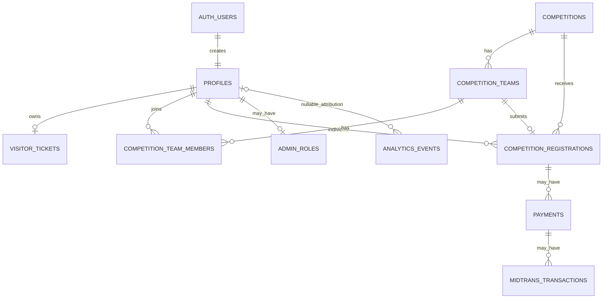

# ERD and schema overview

**Canonical schema overview.** SQL migrations in `supabase/migrations/` are authoritative. This page describes the resulting chain, not proof that a particular remote project has applied it.

## Migration chain

| Migration | Effect |
| --- | --- |
| `0001_initial_schema.sql` | Initial prototype, including legacy `registrations` and `rsvp`. |
| `0002_mvp_schema.sql` | Rebuilds the MVP tables: profiles, visitor tickets, competition/team/registration tables, and admin roles. |
| `0003_submit_team_registration.sql` | Adds the team-submission RPC. |
| `0004_payment_schema.sql` | Sets registration statuses to `submitted`/`verified`/`rejected`, updates the RPC, and adds payment tables. |
| `0005_rls_initplan_optimization.sql` | Rewrites RLS policies to use `(select auth.uid())`. |
| `0006_analytics_events.sql` | Adds `analytics_events`, indexes, and write-only browser insert/read-for-admin policies. |

`0002` drops the legacy `registrations` and `rsvp` tables. Use `visitor_tickets`, never `rsvp`, for current QR tickets.

## Relationship diagram

## Tables and runtime wiring

| Table | Purpose | Active runtime use |
| --- | --- | --- |
| `profiles` | Auth-linked profile | Yes. |
| `visitor_tickets` | One opaque QR ticket and check-in fields per user | Yes; ticket ensure. |
| `competitions` | Registration metadata/foreign keys | Yes; registration APIs keep/find rows for the hardcoded catalog. |
| `competition_teams`, `competition_team_members` | Team UID, leader, and membership | Yes. |
| `competition_registrations` | Individual/team submissions and status | Yes. |
| `admin_roles` | Preferred admin allowlist | Helper exists; not wired to current admin UI. |
| `payments`, `midtrans_transactions` | Payment persistence design | No runtime integration. |
| `analytics_events` | Persistent analytics event design | No active ingest writes. |

## Important constraints

- Registration statuses are `submitted`, `verified`, and `rejected`; a team stays `draft` until final submission.
- The `submit_team_registration` RPC validates the leader and min/max team size atomically and moves a team to `submitted`.
- RLS is enabled on current public tables. Privileged registration/ticket writes use the server-side service client; do not expose its key.
- `analytics_events` accepts insert from anon/authenticated roles in the migration, but the current `/api/track` implementation does not call Supabase.

## Final PRD planned-entity gaps

The PRD additionally requires planned entities for check-ins, booths/scan events, private uploads, RSVP invites, feedback responses, partners/inquiries, programs/sessions, and audit logs. They are absent from migrations `0001`–`0006`; this is a gap register, not an assertion that they exist.

For field-level detail see [DATA-MODEL.md](DATA-MODEL.md); for execution and RLS guidance see [SUPABASE-SCHEMA-PLAN.md](SUPABASE-SCHEMA-PLAN.md).
