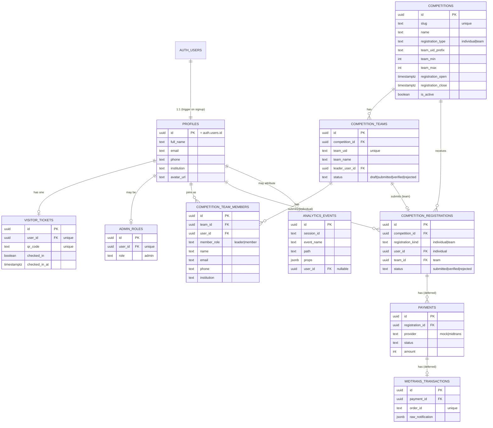

# Data Model / ERD

The database is Supabase Postgres. The schema is defined by the migrations in
`supabase/migrations/` (applied in filename order) and is the ground truth — this document is a
readable summary.

Apply the schema to a live project with:

```bash
supabase link --project-ref <your-project-ref>
supabase db push
```

## Entity-relationship diagram



## Tables

| Table | Purpose | Wired in MVP? |
| --- | --- | --- |
| `profiles` | One row per auth user (auto-created by the `handle_new_user` trigger). | ✅ |
| `visitor_tickets` | Per-user QR entry ticket, ensured at login. | ✅ (created; check-in UI deferred) |
| `competitions` | Competition catalog. Seeded with 3 rows in `0002`. | ✅ |
| `competition_teams` | A team for a team-type competition; `team_uid` is the invite code. | ✅ |
| `competition_team_members` | Members of a team (one `leader` enforced by a partial unique index). | ✅ |
| `competition_registrations` | Final submitted registration (individual or team). | ✅ |
| `admin_roles` | Admin allowlist (falls back to `ADMIN_EMAILS` env). | ⚠️ schema only |
| `analytics_events` | Batched web-analytics events. INSERT-only via anon key. | ✅ |
| `payments` / `midtrans_transactions` | Payment flow. | ⚠️ schema only (deferred) |

## Key rules baked into the schema

- **Profiles auto-provision:** `handle_new_user()` (SECURITY DEFINER) + `on_auth_user_created`
  trigger insert a `profiles` row whenever an `auth.users` row is created.
- **RLS is read-only.** Every table has RLS enabled with SELECT policies only — there are **no
  INSERT/UPDATE/DELETE policies**. All writes therefore go through the **service-role** client in
  API routes (`src/lib/supabase/server.ts::createServiceClient`), after server-side validation.
  The one exception is `analytics_events`, which grants anon/authenticated `INSERT` (write-only).
- **Atomic team submit:** `submit_team_registration(p_team_id, p_leader_user_id)` (RPC, granted to
  `service_role`) locks the team row, validates leader + `draft` status + member count within
  `[team_min, team_max]`, inserts the registration, and flips the team to `submitted` in one call.
- **Uniqueness / anti-race:** partial unique indexes enforce one leader per team, one individual
  registration per (competition, user), and one team registration per (competition, team). API
  routes handle Postgres `23505` (unique violation) gracefully.

## Analytics batching design

`analytics_events` is written by a client-side queue (`src/lib/analytics/queue.ts`) that buffers
events and flushes them as a **single bulk INSERT** to the Supabase REST endpoint — on reaching a
batch size (15), on a 15s timer, or on page hide (`fetch(..., { keepalive: true })`). This keeps
write volume to roughly one request per batch instead of one per event, so a busy session does not
fan out into the DB.
